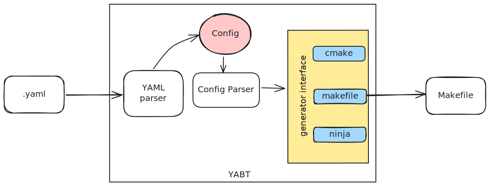

# Yet Another Build Tool (YABT)

This is a attempt to create a YAML based build tool for "C" and "C++" Programming. 

The idea is to create a very high level `yaml` based build system which is very is to read/write/update, will generate be abale to generate to other build system like: Makefile, Ninja-build

## IDEA

## TODO
 - [X] Create a basic YAML format for reading. [example](examples/project/yabt.yaml)
 - [X] Create example Project
 - [ ] Create YAML Config parser
 - [ ] Create Generator Interface
 - [ ] Create Makefile generator
 - [ ] ~~Create Scons generator~~
 - [ ] ~~Create CMake generator~~
 - [ ] Create Ninja build generator
